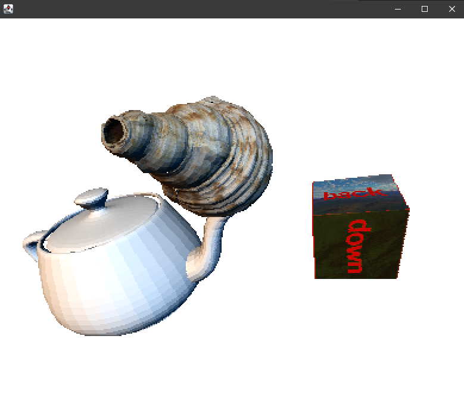
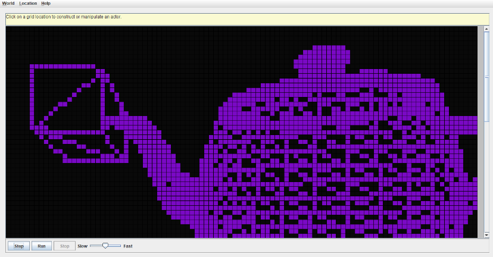

# critter-3d-engine
A basic 3D engine implemented with Java.
This program was originally interfaced with the AP Computer Science "GridWorld" project, but the logic of the
engine was isolated from the project for performance and other limitations.
The original assignment that was developed with this project is located [here](https://docs.google.com/document/d/1MLoiBiA2aGNJt47wUIgn6nQSzdvB5Oo5CMJqowSeZwI/edit?usp=sharing).

  

<b>Upgraded execution</b>

  

<b>Original execution with GridWorld</b>

## Features
- Basic shading with customizable lights and meshes
- .OBJ importer to preview any models
- Proper depth buffering
- UV mapping and texturing

## How to use
Scenes can be configured in the `MainWindow.java` class. A complete demonstration of importing and
initializing models can be found in the `main` function.

Place any textures and .OBJ files inside the `resources` folder.

.OBJ files can easily be exported from any 3D editing program and imported to the engine.
If using Blender, ensure that the export includes UV data and "Keep Vertex Order" is enabled.
Textures must be PNG-32.

## Attribution
- Cube texture sourced from [Wikipedia](https://en.wikipedia.org/wiki/Cube_mapping)
- Seashell model and texture sourced from [BlenderBoom](https://www.blenderboom.com/product/sea_shell/)
- Utah teapot model sourced from [The University of Utah Website](https://www.cs.utah.edu/~natevm/newell_teaset/newell_teaset.zip)
